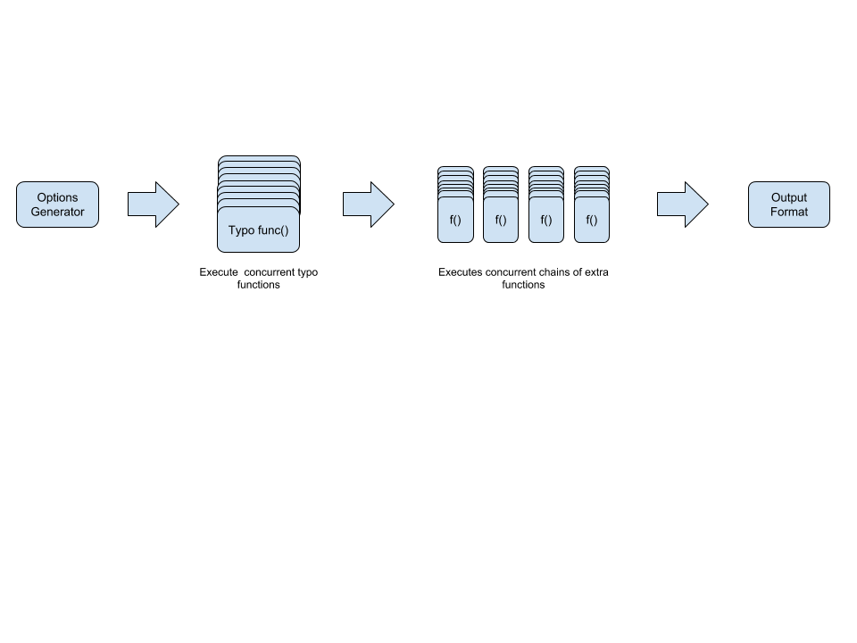

# URLInsane

Multilingual domain typo permutation engine used to perform or detect typosquatting, 
brandjacking, URL hijacking, fraud, phishing attacks, corporate espionage and 
threat intelligence.


Table of contents
=================

<!--ts-->
   * [Table of contents](#table-of-contents)
   * [Introduction](#introduction)
   * [Installation](#installation)
   * [Usage](#usage)
   * [Features](#features)
   * [Languages](#languages)
      * [English](#english)
   * [Algorithms](#algorithms)
   * [Extra Functions](#extra-functions)
      * [TODO](#todo)
   * [Authors](#authors)
   * [License](#license)
<!--te-->


## Introduction

```
urlinsane google.com  -t co -x all

 _   _  ____   _      ___
| | | ||  _ \ | |    |_ _| _ __   ___   __ _  _ __    ___
| | | || |_) || |     | | | '_ \ / __| / _' || '_ \  / _ \
| |_| ||  _ < | |___  | | | | | |\__ \| (_| || | | ||  __/
 \___/ |_| \_\|_____||___||_| |_||___/ \__,_||_| |_| \___|

 Version: 0.3.0

   LIVE  | TYPE |   TYPO    | SUFFIX |        MX        |      IPV4      |           IPV6           |   IDNA    |              TXT               |        NS        | CNAME | SIM |    REDIRECT     |      GEO       
+--------+------+-----------+--------+------------------+----------------+--------------------------+-----------+--------------------------------+------------------+-------+-----+-----------------+---------------+
  ONLINE | CO   | oogle.com | com    | mx.zoho.com      | 104.28.28.162  |                          | oogle.com | v=spf1 +a +mx +ip4:204.9.184.9 | mx.zoho.com      |       |     | oogle.com       | United States  
         |      |           |        | mx2.zoho.com     | 104.28.29.162  |                          |           | +include:zoho.com ~all         | mx2.zoho.com     |       |     |                 |                
  ONLINE | CO   | googl.com | com    |                  | 172.217.11.4   | 2607:f8b0:4006:814::2004 | googl.com | v=spf1 -all                    |                  |       | 63% | www.google.com  | United States  
  ONLINE | CO   | gogle.com | com    |                  | 172.217.11.4   | 2607:f8b0:4006:814::2004 | gogle.com | v=spf1 -all                    |                  |       | 74% | www.google.com  | United States  
  ONLINE | CO   | googe.com | com    |                  | 162.243.10.151 |                          | googe.com | v=spf1 -all                    |                  |       |     | luj.sdsjweb.com | United States  
  ONLINE | CO   | goole.com | com    | mx00.1and1.co.uk | 217.160.0.201  |                          | goole.com |                                | mx00.1and1.co.uk |       | 0%  | www.goole.com   | Germany        
         |      |           |        | mx01.1and1.co.uk |                |                          |           |                                | mx01.1and1.co.uk |       |     |                 |                
  ONLINE | CO   | gogle.com | com    |                  | 172.217.11.4   | 2607:f8b0:4006:814::2004 | gogle.com | v=spf1 -all                    |                  |       | 69% | www.google.com  | United States  
```

The engine is designed to execute concurrent typo algorithms then additional 
concurrent functions for each domain variation. The additional functions can 
check DNS records and much more. Its also designed for extensibility, allowing 
developers to add functionality and support for additional languages. See 
[URLInsane](https://rangertaha.github.io/urlinsane/) for more details.




**Documentation:** [URLInsane Docs](https://rangertaha.github.io/urlinsane/)

**Downloads:** [URLInsane Downloads](https://github.com/rangertaha/urlinsane/releases/tag/0.3.0)

## Installation

To get the latest updates, create the binary executable with the **make** command or 
[download](https://github.com/rangertaha/urlinsane/releases/tag/0.3.0) one of the 
pre-built release binaries. 

Get the project
```bash
go get github.com/rangertaha/urlinsane
```

Go to the project folder and run the **make** command.
```bash
cd ~/go/src/github.com/rangertaha/urlinsane/
make
```

After building the binary you can execute it within the **builds** directory 
that was created by the **make** command. 
```bash
cd builds/
./urlinsane -h
```

## Usage
Generates variations for **google.com** using the character omission **(CO)** 
algorithm.
```
urlinsane google.com -t co

 _   _  ____   _      ___
| | | ||  _ \ | |    |_ _| _ __   ___   __ _  _ __    ___
| | | || |_) || |     | | | '_ \ / __| / _' || '_ \  / _ \
| |_| ||  _ < | |___  | | | | | |\__ \| (_| || | | ||  __/
 \___/ |_| \_\|_____||___||_| |_||___/ \__,_||_| |_| \___|

 Version: 0.2.0

  LIVE | TYPE |   TYPO    | SUFFIX |   IDNA     
+------+------+-----------+--------+-----------+
       | CO   | gogle.com | com    | gogle.com  
       | CO   | gogle.com | com    | gogle.com  
       | CO   | oogle.com | com    | oogle.com  
       | CO   | googe.com | com    | googe.com  
       | CO   | goole.com | com    | goole.com  
       | CO   | googl.com | com    | googl.com  

```

Additional e**x**tra functions can be selected with the **-x, --funcs** options. 
These functions can add columns to the output. For example the following generates 
variations for **google.com** using the character omission **(CO)** algorithm 
then checks for **ip** addresses. 
```
urlinsane google.com -t co  -x geo

 _   _  ____   _      ___
| | | ||  _ \ | |    |_ _| _ __   ___   __ _  _ __    ___
| | | || |_) || |     | | | '_ \ / __| / _' || '_ \  / _ \
| |_| ||  _ < | |___  | | | | | |\__ \| (_| || | | ||  __/
 \___/ |_| \_\|_____||___||_| |_||___/ \__,_||_| |_| \___|

 Version: 0.3.0

   LIVE  | TYPE |   TYPO    | SUFFIX |      IPV4      |           IPV6           |      GEO       
+--------+------+-----------+--------+----------------+--------------------------+---------------+
  ONLINE | CO   | googe.com | com    | 162.243.10.151 |                          | United States  
  ONLINE | CO   | gogle.com | com    | 216.58.219.228 | 2607:f8b0:4006:80f::2004 | United States  
  ONLINE | CO   | googl.com | com    | 216.58.219.228 | 2607:f8b0:4006:80f::2004 | United States  
  ONLINE | CO   | oogle.com | com    | 104.28.28.162  |                          | United States  
         |      |           |        | 104.28.29.162  |                          |                
  ONLINE | CO   | goole.com | com    | 217.160.0.201  |                          | Germany        
  ONLINE | CO   | gogle.com | com    | 216.58.219.228 | 2607:f8b0:4006:80f::2004 | United States   
```

Generates variations for **google.com** with the following parameters:
* **-t hg** lets us use the Homoglyphs(HG) algorithm only
* **-v** Verbose mode shows us the full name 'Homoglyphs' of the algorithm not 
just the short name 'HG'
* **-x ip** Check or ip address
* **-x idna** Shows the IDNA format
* **-x ns** Checks for DNS NS records

```
urlinsane google.com -t hg -v -x ip -x idna -x ns

 _   _  ____   _      ___
| | | ||  _ \ | |    |_ _| _ __   ___   __ _  _ __    ___
| | | || |_) || |     | | | '_ \ / __| / _' || '_ \  / _ \
| |_| ||  _ < | |___  | | | | | |\__ \| (_| || | | ||  __/
 \___/ |_| \_\|_____||___||_| |_||___/ \__,_||_| |_| \___|

 Version: 0.3.0

   LIVE  |    TYPE    |    TYPO    | SUFFIX |      IPV4       |         IPV6          |        IDNA        |             NS              
+--------+------------+------------+--------+-----------------+-----------------------+--------------------+----------------------------+
         | Homoglyphs | Ԍoogle.com | com    |                 |                       | xn--oogle-tyf.com  |                             
         | Homoglyphs | ɢoogle.com | com    |                 |                       | xn--oogle-wmc.com  |                             
         | Homoglyphs | ցoogle.com | com    |                 |                       | xn--oogle-vjg.com  |                             
         | Homoglyphs | ǵoogle.com | com    |                 |                       | xn--oogle-72b.com  |                             
  ONLINE | Homoglyphs | ģoogle.com | com    | 141.8.224.93    |                       | xn--oogle-71a.com  |                             
  ONLINE | Homoglyphs | ɡoogle.com | com    | 69.172.201.153  |                       | xn--oogle-qmc.com  |                             
  ONLINE | Homoglyphs | ğoogle.com | com    | 185.53.179.24   |                       | xn--oogle-j1a.com  |                             
  ONLINE | Homoglyphs | ġoogle.com | com    | 216.239.38.21   | 2001:4860:4802:34::15 | xn--oogle-v1a.com  |                             
         |            |            |        | 216.239.36.21   | 2001:4860:4802:36::15 |                    |                             
         |            |            |        | 216.239.32.21   | 2001:4860:4802:38::15 |                    |                             
         |            |            |        | 216.239.34.21   | 2001:4860:4802:32::15 |                    |                             
         | Homoglyphs | gΟogle.com | com    |                 |                       | xn--gogle-95d.com  |                             
         | Homoglyphs | gОogle.com | com    |                 |                       | xn--gogle-1se.com  |                             
         | Homoglyphs | gοogle.com | com    |                 |                       | xn--gogle-rce.com  |                             
         | Homoglyphs | gՕogle.com | com    |                 |                       | xn--gogle-dcg.com  |                             
  ONLINE | Homoglyphs | gȯogle.com | com    | 104.27.159.151  |                       | xn--gogle-6dc.com  |                             
         |            |            |        | 104.27.158.151  |                       |                    |                             
  ONLINE | Homoglyphs | gọogle.com | com    | 52.58.179.61    |                       | xn--gogle-281b.com |                             
  ONLINE | Homoglyphs | gơogle.com | com    | 103.224.182.214 |                       | xn--gogle-uob.com  |                             
         | Homoglyphs | gỏogle.com | com    |                 |                       | xn--gogle-f91b.com |                             
         | Homoglyphs | gӧogle.com | com    |                 |                       | xn--gogle-isf.com  |                             
         | Homoglyphs | gةogle.com | com    |                 |                       | xn--gogle-pdh.com  |                             
  ONLINE | Homoglyphs | göogle.com | com    | 217.76.156.252  |                       | xn--gogle-jua.com  |                             
  ONLINE | Homoglyphs | góogle.com | com    | 217.70.184.38   |                       | xn--gogle-0ta.com  |                             
         | Homoglyphs | gهogle.com | com    |                 |                       | xn--gogle-uih.com  |                             
         | Homoglyphs | goΟgle.com | com    |                 |                       | xn--gogle-b6d.com  |                             
         | Homoglyphs | goОgle.com | com    |                 |                       | xn--gogle-2se.com  |                             
         | Homoglyphs | goȯgle.com | com    |                 |                       | xn--gogle-7dc.com  |                             
         | Homoglyphs | goоgle.com | com    |                 |                       | xn--gogle-kye.com  |                             
         | Homoglyphs | goՕgle.com | com    |                 |                       | xn--gogle-ecg.com  |                             
  ONLINE | Homoglyphs | goógle.com | com    | 103.224.182.241 |                       | xn--gogle-1ta.com  |                             
         | Homoglyphs | goỏgle.com | com    |                 |                       | xn--gogle-g91b.com |                             
  ONLINE | Homoglyphs | goơgle.com | com    | 103.224.182.214 |                       | xn--gogle-vob.com  |                             
         | Homoglyphs | goӧgle.com | com    |                 |                       | xn--gogle-jsf.com  |                             
         | Homoglyphs | goögle.com | com    |                 |                       | xn--gogle-kua.com  |                             
         | Homoglyphs | goةgle.com | com    |                 |                       | xn--gogle-qdh.com  |                             
         | Homoglyphs | goهgle.com | com    |                 |                       | xn--gogle-vih.com  |                             
  ONLINE | Homoglyphs | gooɢle.com | com    | 50.63.202.63    |                       | xn--goole-zmc.com  |                             
  ONLINE | Homoglyphs | gooɡle.com | com    | 64.90.41.174    |                       | xn--goole-tmc.com  |                             
         | Homoglyphs | gooԌle.com | com    |                 |                       | xn--goole-wyf.com  |                             
         | Homoglyphs | gooġle.com | com    |                 |                       | xn--goole-y1a.com  |                             
         | Homoglyphs | gooԌle.com | com    |                 |                       | xn--goole-wyf.com  |                             
         | Homoglyphs | gooցle.com | com    |                 |                       | xn--goole-yjg.com  |                             
         | Homoglyphs | gooğle.com | com    |                 |                       | xn--goole-m1a.com  |                             
         | Homoglyphs | gooģle.com | com    |                 |                       | xn--goole-b2a.com  |                             
         | Homoglyphs | gooǵle.com | com    |                 |                       | xn--goole-b3b.com  |                             
  ONLINE | Homoglyphs | googłe.com | com    | 46.4.60.204     |                       | xn--googe-n7a.com  |                             
         | Homoglyphs | goog١e.com | com    |                 |                       | xn--googe-enh.com  |                             
         | Homoglyphs | gоogle.com | com    |                 |                       | xn--gogle-jye.com  |                             
         | Homoglyphs | googɫe.com | com    |                 |                       | xn--googe-koc.com  |                             
         | Homoglyphs | Ԍoogle.com | com    |                 |                       | xn--oogle-tyf.com  |                             
  ONLINE | Homoglyphs | googlé.com | com    | 185.53.178.6    |                       | xn--googl-fsa.com  |                             
         | Homoglyphs | goοgle.com | com    |                 |                       | xn--gogle-sce.com  |                             
         | Homoglyphs | googاe.com | com    |                 |                       | xn--googe-gdh.com  |                             
  ONLINE | Homoglyphs | goọgle.com | com    | 217.70.184.38   |                       | xn--gogle-381b.com |                             
  ONLINE | Homoglyphs | googlê.com | com    | 213.186.33.2    |                       | xn--googl-lsa.com  |                             
         | Homoglyphs | googlë.com | com    |                 |                       | xn--googl-rsa.com  |                             
         | Homoglyphs | googlē.com | com    |                 |                       | xn--googl-mza.com  |                             
         | Homoglyphs | googlĕ.com | com    |                 |                       | xn--googl-yza.com  |                             
  ONLINE | Homoglyphs | googlẹ.com | com    | 169.228.66.131  |                       | xn--googl-r51b.com |                             
         | Homoglyphs | googlе.com | com    |                 |                       | xn--googl-3we.com  |                             
         | Homoglyphs | googlҽ.com | com    |                 |                       | xn--googl-flf.com  |                             
  ONLINE | Homoglyphs | googlė.com | com    | 52.78.124.149   |                       | xn--googl-b0a.com  |                             
  ONLINE | Homoglyphs | googlę.com | com    | 45.79.99.143    |                       | xn--googl-n0a.com  |                             
         | Homoglyphs | googlє.com | com    |                 |                       | xn--googl-f2e.com  |                             
         | Homoglyphs | googlϵ.com | com    |                 |                       | xn--googl-4le.com  |                             
         | Homoglyphs | googlě.com | com    |                 |                       | xn--googl-z0a.com  |                             
  ONLINE | Homoglyphs | googe.com  | com    | 162.243.10.151  |                       | googe.com          |                             
         | Homoglyphs | qoogle.com | com    |                 |                       | qoogle.com         |                             
         | Homoglyphs | go0gle.com | com    |                 |                       | go0gle.com         |                             
  ONLINE | Homoglyphs | gooqle.com | com    | 67.227.226.241  |                       | gooqle.com         | mx156.hostedmxserver.com    
         | Homoglyphs | goog1e.com | com    |                 |                       | goog1e.com         |                             
  ONLINE | Homoglyphs | googie.com | com    | 209.17.116.2    |                       | googie.com         | inbound.registeredsite.com  
  ONLINE | Homoglyphs | g0ogle.com | com    | 98.124.199.83   |                       | g0ogle.com         |                             
  ONLINE | Homoglyphs | googe.com  | com    | 162.243.10.151  |                       | googe.com          |                             

```

For more details look at the **-h --help** output.
```
urlinsane -h

Multilingual domain typo permutation engine used to perform or detect typosquatting, brandjacking, URL hijacking, fraud, phishing attacks, corporate espionage and threat intelligence.

USAGE:
  urlinsane [domains] [flags]

OPTIONS:
  -c, --concurrency int         Number of concurrent workers (default 50)
  -f, --file string             Output filename
  -o, --format string           Output format (csv, text) (default "text")
  -x, --funcs stringArray       Extra functions for retrieving additional data (default [idna])
  -h, --help                    help for urlinsane
  -k, --keyboards stringArray   Keyboards/layouts ID to use (default [en1])
  -t, --typos stringArray       Types of typos to perform (default [all])
  -v, --verbose                 Output additional details

KEYBOARDS:
  EN4	English DVORAK keyboard layout
  ES1	Spanish keyboard layout
  EN2	English AZERTY keyboard layout
  RU3	PC Russian keyboard layout
  ES2	Spanish ISO keyboard layout
  FI1	Finnish QWERTY keybaord layout
  AR2	Arabic PC keyboard layout
  AR4	Arabic keyboard layout
  EN3	English QWERTZ keyboard layout
  RU2	Phonetic Russian keybaord layout
  AR1	Arabic keyboard layout
  EN1	English QWERTY keyboard layout
  RU1	Russian keyboard layout
  AR3	Arabic North african keyboard layout
  ALL	Use all keyboards

TYPOS: These are the types of typo/error algorithms that generate the domain variants
  MD	Missing Dot is created by omitting a dot from the domain.
  MDS	Missing Dashes is created by omitting a dash from the domain.
  CO	Character Omission Omitting a character from the domain.
  CS	Character Swap Swapping two consecutive characters in a domain
  ACS	Adjacent Character Substitution replaces adjacent characters
  ACI	Adjacent Character Insertion inserts adjacent character 
  CR	Character Repeat Repeats a character of the domain name twice
  DCR	Double Character Replacement repeats a character twice.
  SD	Strip Dashes is created by omitting a dash from the domain
  SP	Singular Pluralise creates a singular domain plural and vice versa
  CM	Common Misspellings are created from a dictionary of commonly misspelled words
  VS	Vowel Swapping is created by swaps vowels
  HG	Homoglyphs replaces characters with characters that look similar
  WTLD	Wrong Top Level Domain
  W2TLD	Wrong Second Level Domain
  W3TLD	Wrong Third Level Domain
  HP	Homophones Typos are created from sets of words that sound the same
  BF	Bitsquatting relies on random bit-errors to redirect connections
  NS	Numeral Swap numbers, words and vice versa
  ALL   Apply all typosquatting algorithms

FUNCTIONS: Post processig functions that retieve aditional information on each domain variant.
  MX	Checking for DNS's MX records
  IP	Checking for IP address
  IDNA	Show international domain name
  TXT	Checking for DNS's TXT records
  NS	Checks DNS NS records
  CNAME	Checks DNS CNAME records
  SIM	Show domain content similarity
  LIVE	Show domains with ip addresses only
  301	Show domains redirects
  GEO	Looks up geopgraphic information via IP address
  ALL  	Apply all post typosquating functions

EXAMPLE:

    urlinsane google.com
    urlinsane google.com -t co
    urlinsane google.com -t co -x ip -x idna -x ns

AUTHOR:
  Written by Rangertaha <rangertaha@gmail.com>
```


## Features

* Binary executable, written in Go with no dependencies. 
* Will have all the functionally of URLCrazy and DNSTwist. 
* Contains 19 typosquatting algorithms and 10 extra functions to retrieve additional data such as ip to geographic location, dns lookups and more 
* Modular architecture for language, keyboard, typo algorithm, and functions extensibility.
* Supports multiple keyboard layouts found in English, Spanish, Russian, Finish, and Arabic.
* Supports multiple languages with the ability to add more languages with ease.
* Concurrent function (**-x --funcs**) workers to retrieve additional info on each record.
* Concurrent typo squatting workers.

## Languages

### English

* Over 8000 common misspellings
* Over 500 common homophones
* Registered graphemes, vowels, homoglyphs, and numerals
* Common keyboard layouts (qwerty, azerty, qwertz, dvorak)

### Finnish, Russian, Persian, Hebrew, Arabic, Spanish

See [Languages](https://rangertaha.github.io/urlinsane/#languages) for details 
on other languages.

## Algorithms

The modular architecture for code extensibility allows developers to add new 
typosquatting algorithms with ease. Currently we have implements 19 
typosquatting algorithms. See [Typo Algorithms](https://rangertaha.github.io/urlinsane/#algorithms) for details.


## Extra Functions

- **IDNA**  Show international domain name (Default)
- **MX**    Checking for DNS's MX records
- **TXT**   Checking for DNS's TXT records
- **IP**    Checking for IP address
- **NS**    Checks DNS NS records
- **CNAME** Checks DNS CNAME records
- **SIM**   Show domain similarity % using fuzzy hashing with ssdeep
- **LIVE**	Show domains with ip addresses only
- **301**	Show domains redirects
- **GEO**	Show country location of ip address

### TODO 

* Estimate popularity of a domain variant via google search
* Lookup whois record
* Emoji domains
* Grabs HTTP and SMTP service banners


## Authors

* [Rangertaha](https://github.com/rangertaha)


## License

This project is licensed under the MIT License - see the [LICENSE](LICENSE) file for details
